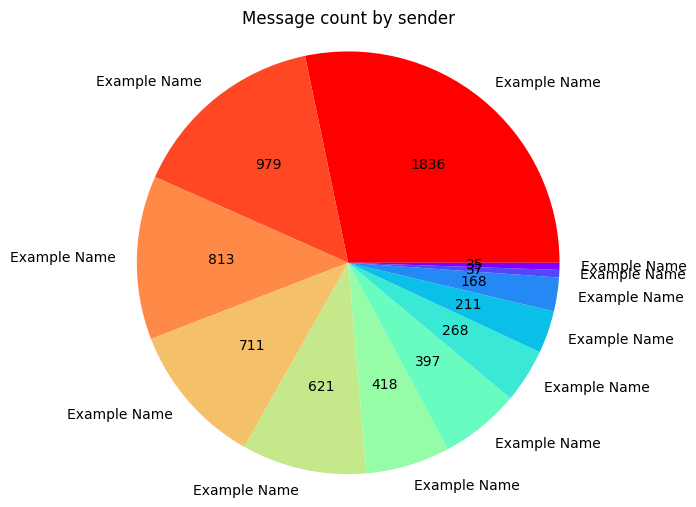
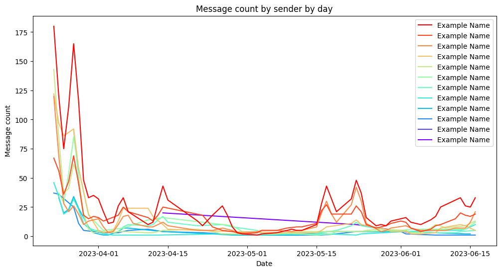

# WhatsApp Chat Statistics

> A simple python script to generate statistics from exported WhatsApp chats.

## Usage

1. Export your WhatsApp chat as a text file.
2. Place the text file in the root directory of this project.
3. Run the Jupyter notebook.

## Dependencies

- Python 3
- Jupyter Notebook
- Numpy
- Pandas
- Matplotlib

## Example

